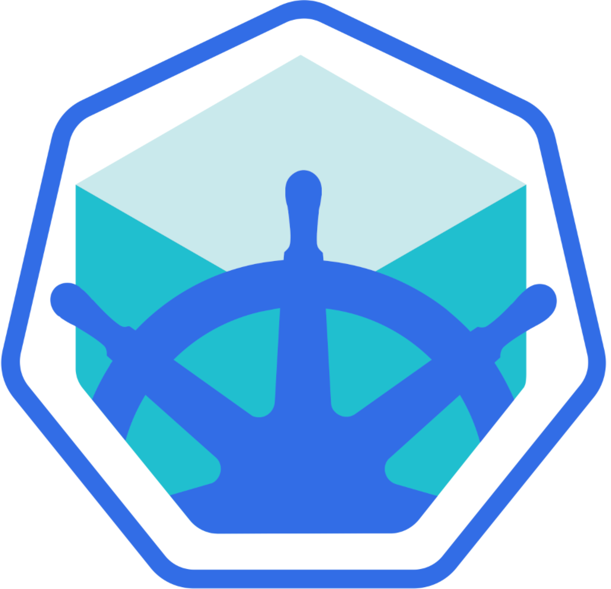

<h1 style="text-align:center"> Demo app - developing with Docker and Kubernetes</h1> 

This demo app is a simple singel page shows minikube pod id that is running set up using 
- pure js file
- nodejs backend with express module
- OS model 

## prerequisites
---

_My advice just download docker desktop it will have minikube built in_

## Get Started
---

### Step 1
---
 Pull the image from dockerhub

    docker pull salahbeeh/k8s-web-server 

### Step 2 (Optional)
---
Edit the image pulled, _Notice: Docker images are by default readonly but you can use it as your base layer_ 

### Step 3 (Optional)
---
 If you done any edits on the image, Containrize your image 
    
    docker build . -t \
    -p 8081:8081 \
    <image-nameOfYourChoice:version>

### Step 4
---
 Create minikube deployment 

    kubectl create deployment <deployment-name> --image=salahbee/k8s-web-server

### Step 5
---
 Scale the deployment to the required number of replicas
    kubectl scale deployment <deployment-name> --replicas=<required num>

Now you can check if the numnber of replicas you specified has been created:
    kubectl get pods

### Step 6
---
Create a service for the deployment  

_Note: kubernetes pods aren't designed to be accessabel so we create services to access/exposs it_
    kubectl expose deployment <deployment-name> --type=NodePort --port=3000
    
### Step 7
---
Access you nodejs application UI from browser
    minikube service <service-name>

## Licence 
---

